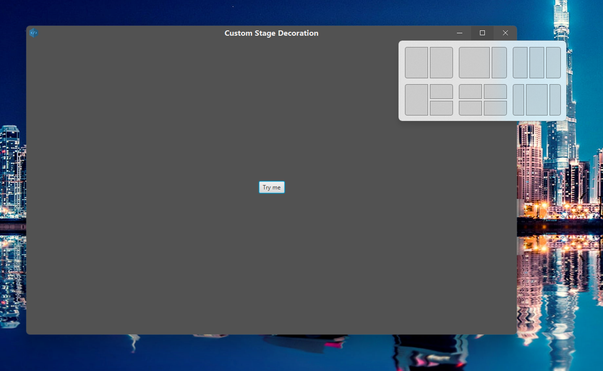

## JavaFX custom Stage decoration example
## WINDOWS ONLY FOR NOW
### Inside the libs folder is the jar you need to implement your own decoration, just look at the example and be creative. 

## Features

*** 
* Native behaviour 
* Custom caption colors or title bar colors (CSS styleable)
* Windows 11 snap layout on maximize button hover/ Windows 10 native tooltips
* Native Window resize
* Native window dragging

***

### Screenshots

  

  

 
  

  

***

 This code is not fully tested, If you have any suggestion or Idea feel free to Issue/Pull request.

* Discord Server [Programming World](https://discord.gg/zDDPS46Qfr)
